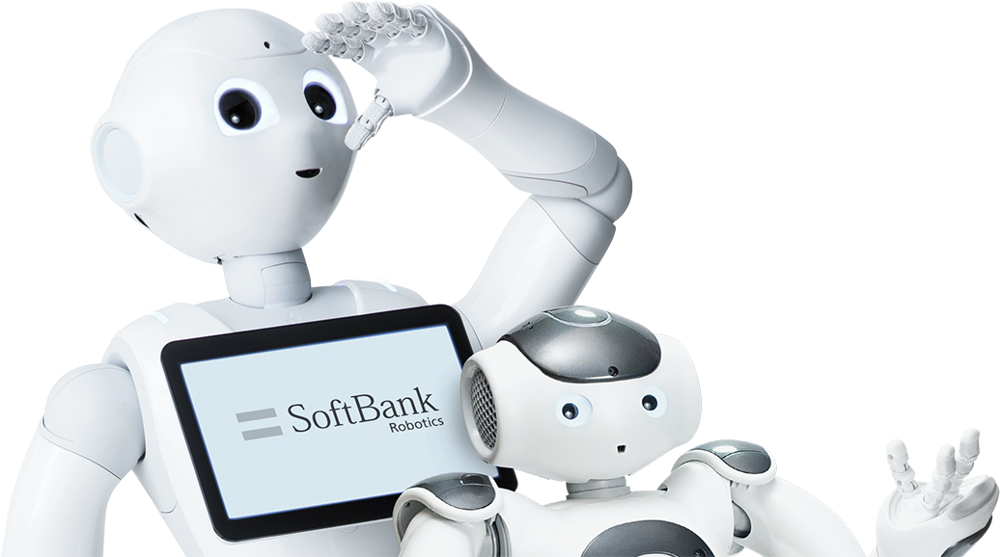

# libqi-python-nvidia-jetson

Compiled qi library for interfacing with Pepper and Nao robots using python on Jetson Nano, Tx2, Xavier.

 





## Requirements

- python 2.7
- JetPack >= 3.3.1

To install the library:

- Download the compiled library from [GDrive](https://drive.google.com/file/d/15qahT8OtEfvigF2H9OvI8wdEENARWx-9/view?usp=sharing).

```bash
tar -xvzf qi_jetson.tar.gz
cd qi_jetson
chmod u+x install.sh
./install.sh
```

## Usage

```python
import qi

# Connect to the robot
session = qi.Session()
session.connect("tcp://127.0.0.1:9559") # Robot IP

# TextToSpeech service
tts = session.service("ALTextToSpeech")
tts.say("Hi, the library works!")

session.close()
```

## Acknowledgements

This library has been compiled starting from the following codes:

- libqi: [https://github.com/aldebaran/libqi](https://github.com/aldebaran/libqi) 
- libqi-python: [https://github.com/aldebaran/libqi-python](https://github.com/aldebaran/libqi-python) 
